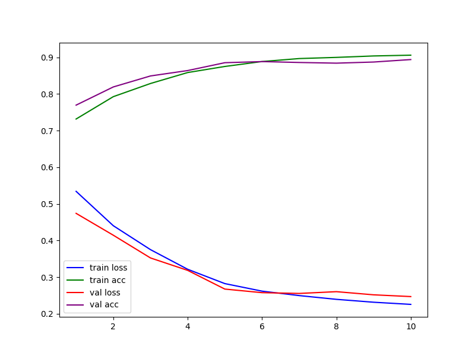

## Task introduction
The task is based on the UCI Machine Learning Repository dataset which provides the air quality data along a period of time. Data is in *'AirQualityUCI _ Students.xlsx'*. The task is focused on time series air quality prediction with LSTM. Specifically, we need to predict whether the concentration of CO(GT) in the next hour is higher than some threshold or not. In the *'demo.ipynb'*, we set threshold as the mean value of the existing CO(GT).
## Environmet requirment
Tensorflow and keras; Pandas; Numpy; Matplotlib; Sklearn
## Results analysis
Detailed data along training is in *'logs.csv'* which is plot into *'process.png'*

Confusion Matrix is printed in *'demo.ipynb'* after
```python
get_cm(y_true, y_pred)
